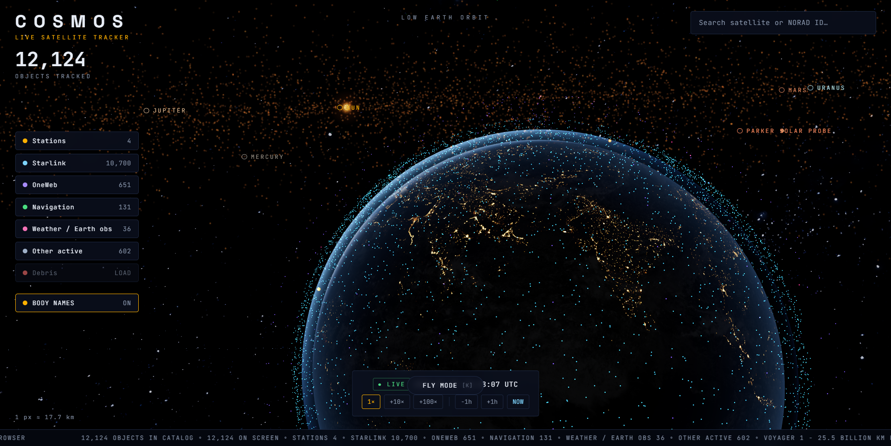

# COSMOS - Live 3D Satellite Tracker & Solar System Explorer

Real-time 3D visualization of every active satellite orbiting Earth, plus the whole solar system at true scale. React + Three.js, all data free and open.

  



## How it works

- **Data**: [CelesTrak GP API](https://celestrak.org/NORAD/elements/) OMM/JSON catalog (~12–16k objects). Fetched at most once per 2 h (CelesTrak policy), cached in IndexedDB, with a bundled snapshot fallback (`public/data/active-snapshot.json`).
- **Propagation**: [satellite.js](https://github.com/shashwatak/satellite-js) SGP4 runs in a **Web Worker** - no live-position API needed; positions are computed for any instant.
- **Rendering**: one GPU point cloud for all satellites. The vertex shader extrapolates `position + velocity × dt` between worker snapshots (1 update / 30 sim-seconds), so per-frame CPU cost is near zero.
- **Earth**: custom shaders - 8k day/night blend along the true sun vector, ocean specular glint, normal-mapped relief, drifting cloud shell, fresnel atmosphere. Earth rotation follows real GMST.

## Features

- Live mode + **time machine**: −1000× … +1000×, ±1h jumps, NOW reset
- Click or search any satellite → orbit line, marker, live telemetry (altitude, velocity, ground point, inclination, period, apogee/perigee)
- **Follow camera** rides the selected satellite
- Category filters: Stations / Starlink / OneWeb / Navigation / Weather / Other
- **Debris toggle** (Cosmos-1408, Fengyun-1C, Iridium-33, Cosmos-2251 clouds), lazy-loaded
- Live telemetry ticker - every number is real
- **The Moon** - real position/phase via astronomy-engine, tidally locked, earthshine, orbit path
- **Scroll-magnet navigation** - no buttons: point at any body (or keep it near screen center) and scroll; the camera is pulled to it, and focus hands off silently by proximity with a seamless floating-origin rebase. Double-click a body to fly there
- **The whole solar system, real scale** - the Sun (procedural lava photosphere, dancing limb flames, erupting prominences), all 8 planets (real positions via astronomy-engine, real axial tilts and spin rates), Saturn's rings with an analytic planet shadow, the Galilean moons (live ephemerides), Saturn's major moons and Triton, heliocentric orbit ellipses, and clickable body labels. Zoom titles from LOW EARTH ORBIT to THE SOLAR SYSTEM
- **Deep-space fleet** - Voyager 1 & 2, New Horizons, JWST and Parker Solar Probe at their true positions from [JPL Horizons](https://ssd.jpl.nasa.gov/horizons/) state vectors; fly to any of them, and watch the ticker count their billions of kilometers from home
- **Keyboard fly mode** - toggle with K, WASD to look, arrows to fly, Q/E for vertical; no orbit restrictions
- Zoom-level titles (LOW EARTH ORBIT → CISLUNAR SPACE) + live scale ruler

## Run

```bash
npm install
npm run dev     # http://localhost:5173
npm run build   # production build in dist/
```

## Code map

```
src/
  engine/SatelliteEngine.ts    worker bridge, shared buffers, picking, live samples
  workers/propagator.worker.ts SGP4 in a Web Worker (satellite.js)
  lib/celestrak.ts             catalog fetch + IndexedDB cache + fallbacks
  lib/sun.ts                   solar position (day/night terminator)
  scene/                       Earth, satellites point cloud, orbit, camera, picking
  ui/                          HUD, search, filters, info panel, time controls, ticker
  store/useStore.ts            zustand: catalog, filters, selection, sim clock
```

## Creative playground

This isn't just a tracker - it's a 3D canvas. Some ideas:

- **Custom shaders** - replace Earth's atmosphere with neon glow, make satellites pulse, add aurora, warp space near black holes
- **Camera experiments** - new fly modes, cinematic orbit path recording, VR180 rig
- **Data art** - visualize satellite density as heatmaps, draw constellation connections, trace orbital decay
- **Audio-visual** - sonify telemetry, drive music visuals from orbital parameters
- **UI/UX** - alternate HUDs, minimaps, retro terminal skins
- **What-if** - add hypothetical objects, simulate collisions, visualize debris spread over decades

No feature is too weird. If it compiles and looks cool, it belongs here.

## Contributing

See [CONTRIBUTING.md](CONTRIBUTING.md). Bug fixes welcome, creative experiments equally welcome.

## Texture credits

- Earth day/night/clouds + Milky Way: [Solar System Scope](https://www.solarsystemscope.com/textures/) (CC BY 4.0)
- Normal/specular maps: [three.js examples](https://github.com/mrdoob/three.js) (MIT)

## License

MIT
